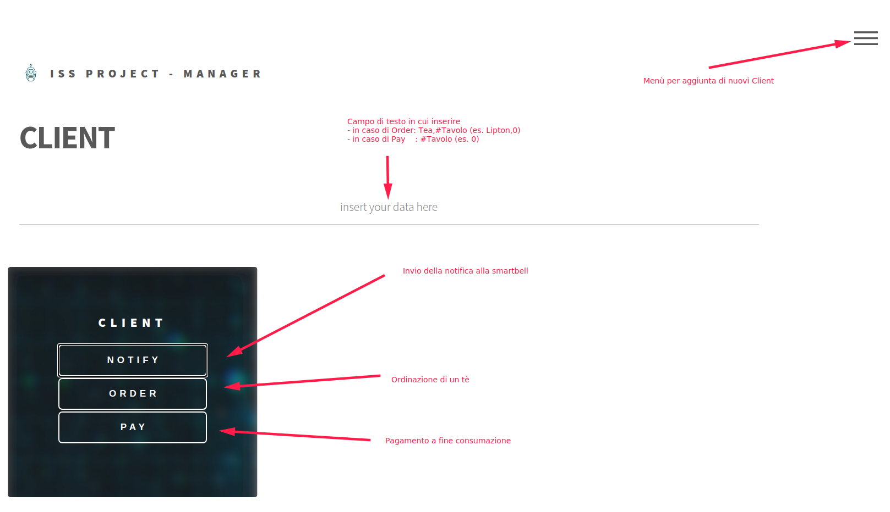
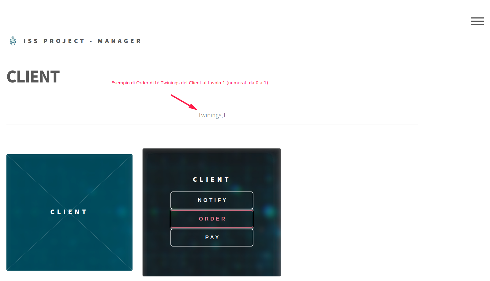
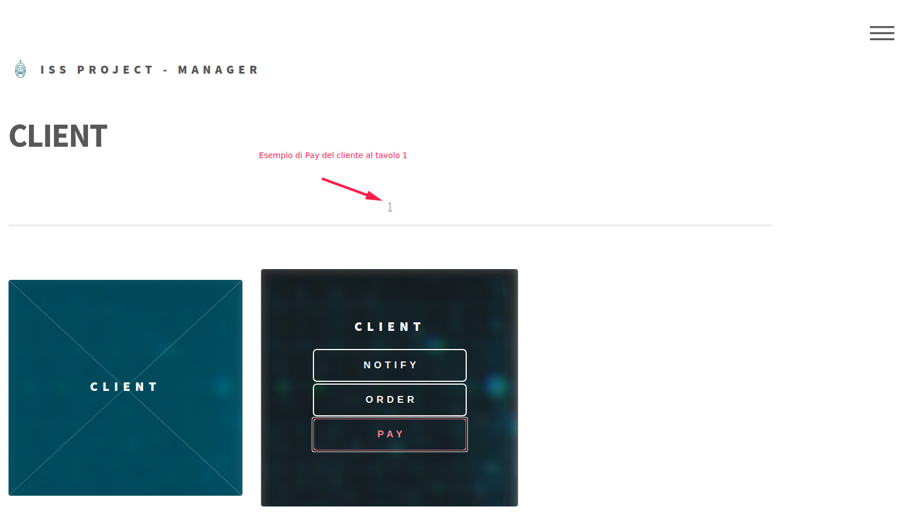
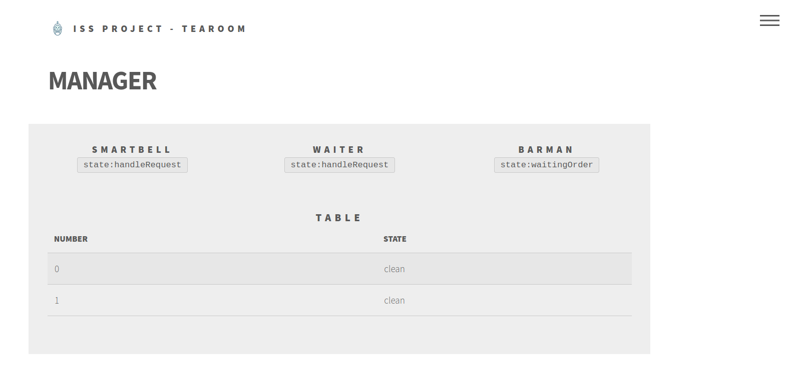

# Progetto esame ISS2020
## Organizzazione Sprint
|Sprint           |Obiettivi                      |
|-----------------|-------------------------------|
|Sprint0	      |Scrittura dell'analisi dei requisiti per l'intero progetto, con confronto delle tecnologie da adottare        |
|Sprint1          |Analisi e sviluppo di una prima versione del sistema, compreso di collegamento al simulatore ed interfaccia grafica            |
|Sprint2          |Analisi e sviluppo del sistema, considerando il caso di *Client* multipli; raffinamento dell'interfaccia grafica|
|Sprint3          |Revisione della modalità di rappresentazione dello stato del sistema; distribuzione su più nodi|

## Configurazione degli hosts
Per favorire il funzionamento del sistema nell'esecuzione distribuita, è possibile definire delle etichette per gli host virtuali come mostrato di seguito, o in alternativa si possono direttamente modificare gli indirizzi IP dei *context* all'interno dei file .qak.

Eseguendo sulla stessa macchina, si può lasciare l'IP `127.0.0.1`, è altrimenti necessario scrivere l'indirizzo IP del nodo remoto.

### Linux
Modificare il file `/etc/hosts` e aggiungere le seguenti righe:
```
127.0.0.1       waiterhost
127.0.0.1       barmanhost
127.0.0.1       smartbellhost
127.0.0.1       tearoomhost
```
### Windows
Modificare il file `c:\Windows\System32\Drivers\etc\hosts` e aggiungere le seguenti righe:
```
127.0.0.1       waiterhost
127.0.0.1       barmanhost
127.0.0.1       smartbellhost
127.0.0.1       tearoomhost
```

## Esecuzione Sprint
In tutti gli Sprint sono presenti  le classi di testing **Junit** utili per i test automatizzati di varie funzionalità.
Inoltre a partire dallo Sprint1 è possible:
* visualizzare gli spostamenti del *Waiter* tramite il simulatore (Virtualrobot);
* simulare le azioni del *Client* grazie all'interfaccia grafica;
* visualizzare lo stato corrente della *Tearoom* dall'interfaccia grafica del *Manager* (nel primo Sprint le due interfacce sono unificate).

É quindi possibile testare il sistema sia in modo automatico che manuale.

### Software necessario
Per poter eseguire il sistema, oltre al software fornito è necessario avere installato:
* Gradle (testato con versione `6.6.1`)
* Java (testato con versione `8` e `11`)

In alternativa al Gradle specificato è possibile utilizzare il Gradle wrapper già incluso.

### Esecuzione Test Junit

Dato che i test si basano su tempi dipendenti dalla macchina che esegue, potrebbero dare esito negativo.
Per questo motivo, sono stati registrati e sono disponibili [qui con una breve descrizione](Video/).

I test Junit sono organizzati in un singolo file (per ogni Sprint), nel quale sono presenti più funzioni di test.
Per attivare una certa funzione di test, è necessario togliere il commento alla chiamata della funzione presente in fondo al file.
```
@kotlinx.coroutines.ObsoleteCoroutinesApi
@kotlinx.coroutines.ExperimentalCoroutinesApi
@Test
fun testTeaRoom(){		
  testCoap()
  //testCoapFullRoom()		
  //testCoapFullRoomOneTimer()
  //testCoapFullRoomTwoTimer()
  //testCoapFullRoomThirdClient()		
  //testKnowledgebase()
  //testTemperatureTooHigh()
  }
}
```

Step per l'esecuzione:
1. posizionarsi nella cartella [Utils/it.unibo.qak20.basicrobot-1.0/bin](Utils/it.unibo.qak20.basicrobot-1.0/bin)
2. eseguire il file [it.unibo.qak20.basicrobot](Utils/it.unibo.qak20.basicrobot-1.0/bin/it.unibo.qak20.basicrobot) (o con estensione `.bat` su Windows) per avviare il **basicrobot**
4. posizionarsi nella cartella `Sprint* > tearoom`
5. eseguire il comando `gradle -b build_ctxtearoom.gradle test` per avviare i test

**NOTE**: 
* di default sarà attivo soltanto un test. Per eseguire tutti i test disponibili è necessario aprire il file `Sprint* > tearoom > src > test > kotlin > tearoom > TestTearoom.kt` relativo allo sprint di interesse e selezionare il metodo di test da eseguire.
* per garantire una esecuzione fluida dei test, il sistema genera per i *Client* una temperatura **sempre** idonea per poter entrare. Si può modificare questo comportamento cambiando il codice all'interno del file qak `tearoom.qak`, nell'actor `smartbell` (`smartbell.qak` se si tratta dell'esecuzione del sistema su nodi distribuiti).
```
// rimuovere il commento a questa riga
[# var Temperature = (35..38).random() #]
// commentare questa
[# var Temperature = 36 #]
```

### Esecuzione Test con Simulatore
1. posizionarsi nella cartella [Utils/it.unibo.qak20.basicrobot-1.0/bin](Utils/it.unibo.qak20.basicrobot-1.0/bin)
2. eseguire il file [it.unibo.qak20.basicrobot](Utils/it.unibo.qak20.basicrobot-1.0/bin/it.unibo.qak20.basicrobot) (o con estensione `.bat` su Windows) per avviare il **basicrobot**
3. posizionarsi nella cartella [Utils/it.unibo.virtualRobot2020/node/WEnv/server/src](Utils/it.unibo.virtualRobot2020/node/WEnv/server/src) 
4. eseguire il comando `node main 8999` per avviare il **VirtualRobot** (simulatore)
5. andare alla pagina web con indirizzo `localhost:8090` per vedere la simulazione
6. posizionarsi nella cartella `Sprint* > tearoom`
7. eseguire il comando `gradle -b build_ctxtearoom.gradle test` per **avviare i test**

### Esecuzione Manuale con interfaccia grafica e Simulatore
1. posizionarsi nella cartella [Utils/it.unibo.qak20.basicrobot-1.0/bin](Utils/it.unibo.qak20.basicrobot-1.0/bin)
2. eseguire il file [it.unibo.qak20.basicrobot](Utils/it.unibo.qak20.basicrobot-1.0/bin/it.unibo.qak20.basicrobot) (o con estensione `.bat` su Windows) per avviare il **basicrobot**
3. posizionarsi nella cartella [Utils/it.unibo.virtualRobot2020/node/WEnv/server/src](Utils/it.unibo.virtualRobot2020/node/WEnv/server/src) 
4. eseguire il comando `node main 8999` per avviare il **VirtualRobot** (simulatore)
5. andare alla pagina web con indirizzo `localhost:8090` per vedere la simulazione
6. posizionarsi nella cartella `Sprint* > tearoom`
7. eseguire il comando `gradle -b build_ctxtearoom.gradle run` per **avviare il sistema** (senza test Junit)
8. posizionarsi nella cartella `Sprint* > WebUI > manager`
9. eseguire il comando `gradle run`
10. aprire la pagina web del *Client* al percorso `Sprint* > WebUI > frontend > index.html` e/o quella del *Manager* al percorso `Sprint* > WebUI > frontend > manager.html`

**NOTA**: se le pagine web non dovessero aggiornarsi, sarebbe opportuno eseguire un refresh delle stesse.

## Utilizzo interfaccia web Client
Per effettuare dei test manuali è possibile utilizzare l'interfaccia web Client come descritto al punto 8 del paragrafo precedente.
Di seguito vengono mostrate le operazioni possibili.
| | |
|-----------------|-----------------|
|Prima schermata con sintesi operazioni||
|Esempio Order||
|Esempio Pay||

## Interfaccia Manager

