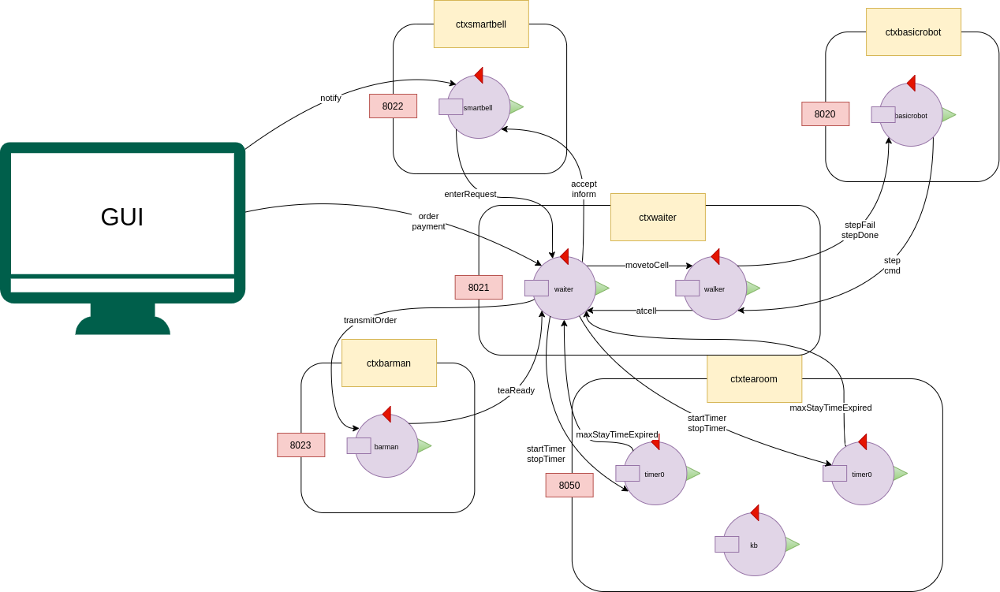

# Analisi del Problema

## Rappresentazione dello stato del sistema

Nell’analisi del problema dello Sprint 2 si è scelto di non utilizzare l’approccio con lo stato del sistema centralizzato in un unico attore.

Durante la retrospective del secondo Sprint si è però deciso di adottare la centralizzazione. In questo modo si riesce ad aumentare la flessibilità del sistema in vista di nuovi requisiti, mantenendo la _Business Logic_ fuori dalla GUI.

In questo caso quindi, sarà introdotto un attore dedicato alla ricezione di aggiornamenti sullo stato degli altri attori. La GUI osserva direttamente questo e riceve così lo stato del sistema aggiornato. 

Questo però porta alla luce la problematica tecnologica relativa alla comunicazione.

Tale scelta infatti inficia in maniera considerevole sulla plasticità del sistema.

Una comunicazione punto-punto o di tipo broadcast potrebbe ridurre di molto lo spazio di manovra delle implementazioni successive.

La scelta, al fine di mantenere maggiormente flessibile il sistema, è ricaduta sull’utilizzo di eventi.

In questo caso infatti ad ogni cambio di stato avremo l'emissione di una certa tipologia di evento. Così facendo ogni eventuale attore aggiuntivo potrà scegliere quali sono gli eventi di suo interesse.

Tutti gli attori saranno quindi in grado di gestire potenzialmente l'evento se necessario.

Qui si palesa la problematica relativa alla sicurezza in quanto tutti potrebbero essere al corrente di tutto.

Nel nostro caso però le informazioni comunicate mediante eventi **non** sono informazioni sensibili o in grado di interferire con il normale svolgimento delle funzionalità.

Tale scelta apre le porte a future implementazioni tra cui ad esempio un attore dedicato al salvataggio dello storico, oppure un altro specializzato nelle post elaborazioni.

L'unica cosa che dovranno sapere sarà il protocollo degli eventi ammissibili e la relativa funzionalità rendendo superflua la conoscenza delle implementazioni o l'architettura del sistema.

La modellazione di questo nuovo approccio e formalizzata nel seguente [file](analisi.qak)

## Architettura Logica
Oltre al sistema presentato fino ad ora, è stata realizzata anche una versione distribuita su più nodi secondo la seguente architettura logica.

*(l'implementazione in questione è disponibile al seguente [link](../distributed/))*

